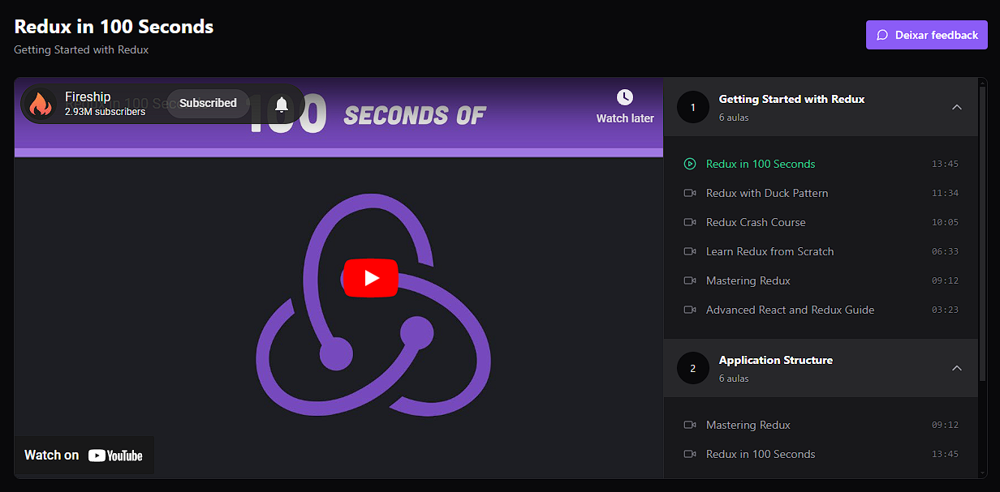

## Project

Showing YouTube videos with Redux and Zustand.

<p style="text-align: center">
  
</p>

This project was developed during a @rocketseat course for study purposes.

## Branches

This project has two branches. The `main` branch has the `zustand` code and the `redux` branch, the `redux` code. 

## Tech

<table>
  <tbody>
    <tr>
        <td>Vite</td>
        <td>TypeScript</td>
        <td>Tailwind</td>
        <td>Axios</td>
    </tr>
    <tr>
        <td>React</td>
        <td>Zustand</td>
        <td>Redux (RTK)</td>
        <td>Redux AsyncThunk</td>
    </tr>
  </tbody>
</table>


### Getting Started

- Install dependencies

```bash
npm install
```

- Start the server (Local JSON Server)
```bash
npm run server
```

- Start the front-end
```bash
npm run dev
```

- Run tests
```bash
npm run test
```

## Contribute

- Fork this repository
- Create a branch with your feature: `git checkout -b my-feature`
- Commit your changes: `git commit -m 'feat: add my new feature'`
- Push it to your branch: `git push origin my-feature`

After merging your pull request, your branch can be deleted.

Check the details about the types, verbs and commit messages here [CONTRIBUTING.md](./.github/CONTRIBUTING.md)

Also check the [CODE_OF_CONDUCT.md](./.github/CODE_OF_CONDUCT.md)

## License

This project is [MIT Licensed](./LICENSE)
